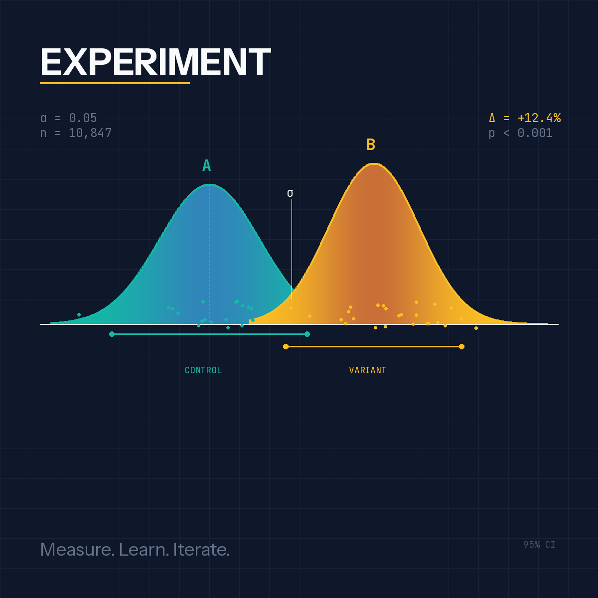

# A/B Experimentation: From Theory to Practice

A hands-on tutorial for understanding experimentation systems by building one.



## Getting Started 
```bash
git clone git@github.com:vepr-ua/ab-experimentation-tutorial.git
cd ab-experimentation-tutorial

# Start virtual environment
uv venv
source .venv/bin/activate
uv pip install -e .

# Run the full tutorial
python notebooks/experiment.py

# Or explore individual modules
python src/simulation.py    # See different scenarios
python src/analysis.py      # Power analysis + stats
python src/assignment.py    # Assignment mechanics
```

## The Anatomy of an Experiment

Every A/B test has these core components:

```
┌─────────────────────────────────────────────────────────────────┐
│                     EXPERIMENT LIFECYCLE                        │
├─────────────────────────────────────────────────────────────────┤
│                                                                 │
│  1. HYPOTHESIS          "Changing X will improve Y by Z%"       │
│         │                                                       │
│         ▼                                                       │
│  2. DESIGN              Sample size, duration, metrics          │
│         │                                                       │
│         ▼                                                       │
│  3. ASSIGNMENT          Hash-based randomization → variants     │
│         │                                                       │
│         ▼                                                       │
│  4. EXPOSURE            Users experience control or treatment   │
│         │                                                       │
│         ▼                                                       │
│  5. MEASUREMENT         Collect events, compute metrics         │
│         │                                                       │
│         ▼                                                       │
│  6. ANALYSIS            Statistical tests, confidence intervals │
│         │                                                       │
│         ▼                                                       │
│  7. DECISION            Ship, iterate, or kill                  │
│                                                                 │
└─────────────────────────────────────────────────────────────────┘
```

## Key Concepts

### 1. The Hypothesis

A good hypothesis is specific and measurable:
- **Bad**: "The new checkout will be better"
- **Good**: "Reducing checkout steps from 3 to 1 will increase conversion rate by 5%"

### 2. Metrics

| Type | Purpose | Example |
|------|---------|---------|
| **Primary** | What you're optimizing for | Conversion rate |
| **Secondary** | Related outcomes you care about | Revenue per user |
| **Guardrail** | Things that shouldn't get worse | Page load time, error rate |

### 3. Statistical Foundation

When we run an experiment, we're trying to answer: "Is the difference we observed real, or just noise?"

**Frequentist approach** (what we'll implement):
- Null hypothesis (H₀): There's no difference between variants
- Alternative hypothesis (H₁): There is a difference
- p-value: Probability of seeing this result if H₀ is true
- Significance level (α): Threshold for rejecting H₀ (typically 0.05)

**The math for conversion rates:**

For binary outcomes (converted/didn't convert), we use a two-proportion z-test:

```
        p̂₁ - p̂₂
z = ─────────────────
    √(p̂(1-p̂)(1/n₁ + 1/n₂))

where p̂ = (x₁ + x₂)/(n₁ + n₂)  (pooled proportion)
```

### 4. Sample Size & Power

Before running an experiment, you need to know how many users you need. This depends on:

- **Baseline conversion rate**: Your current metric value
- **Minimum Detectable Effect (MDE)**: Smallest improvement worth detecting
- **Statistical power (1-β)**: Probability of detecting a real effect (typically 0.8)
- **Significance level (α)**: False positive rate (typically 0.05)

```
         2(Z_α/2 + Z_β)² × p(1-p)
n ≈ ─────────────────────────────────
              (MDE)²
```

### 5. Assignment

Users must be randomly assigned to variants in a way that's:
- **Deterministic**: Same user always sees same variant
- **Uniform**: ~50/50 split (for two variants)
- **Independent**: Assignment to one experiment doesn't affect another

We use **hash-based assignment**: `hash(user_id + experiment_id) % 100 < 50 → control`

## Project Structure

```
ab-experimentation-tutorial/
├── README.md
├── pyproject.toml
├── src/
│   ├── __init__.py
│   ├── assignment.py      # User → variant assignment
│   ├── metrics.py         # Metric computation
│   ├── analysis.py        # Statistical tests
│   └── simulation.py      # Generate synthetic data
└── notebooks/
    └── experiment.py      # Run the full experiment
```

## Quick Start

```bash
# Install uv if you haven't
curl -LsSf https://astral.sh/uv/install.sh | sh

# Create and activate virtual environment
uv venv
source .venv/bin/activate  # or `.venv\Scripts\activate` on Windows

# Install dependencies
uv pip install -e .

# Run the experiment
python notebooks/experiment.py
```

## What You'll Learn

1. **Assignment mechanics**: How production systems ensure consistent, random assignment
2. **Power analysis**: Why sample size matters and how to calculate it
3. **Statistical testing**: Implementing z-tests and interpreting results
4. **Confidence intervals**: Understanding uncertainty in your estimates
5. **Common pitfalls**: Peeking, multiple comparisons, Simpson's paradox
